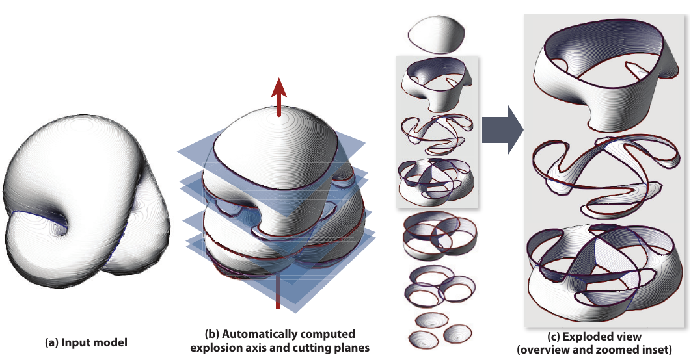
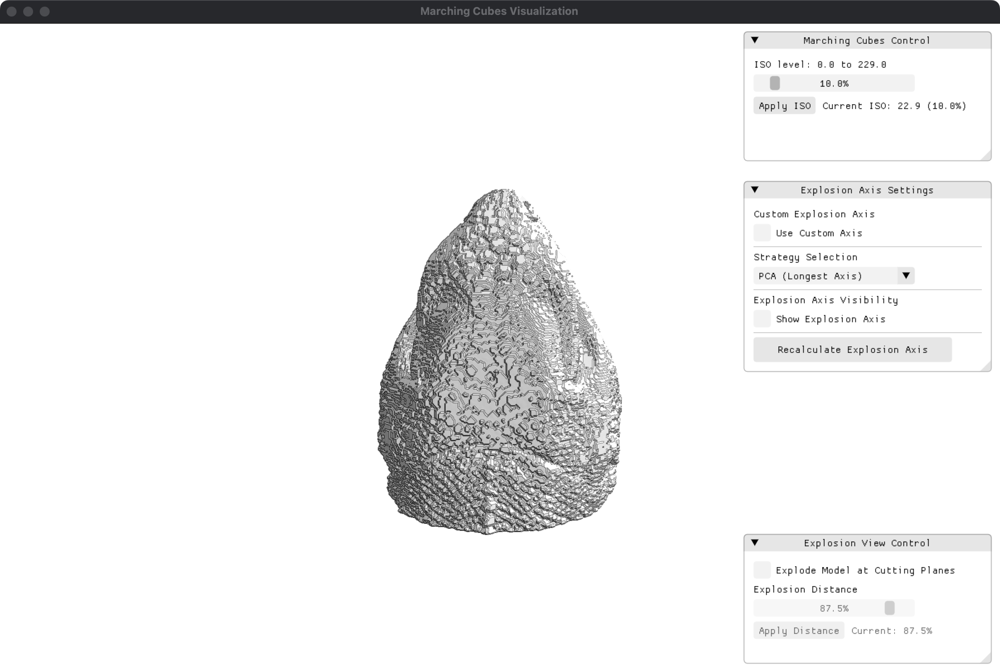
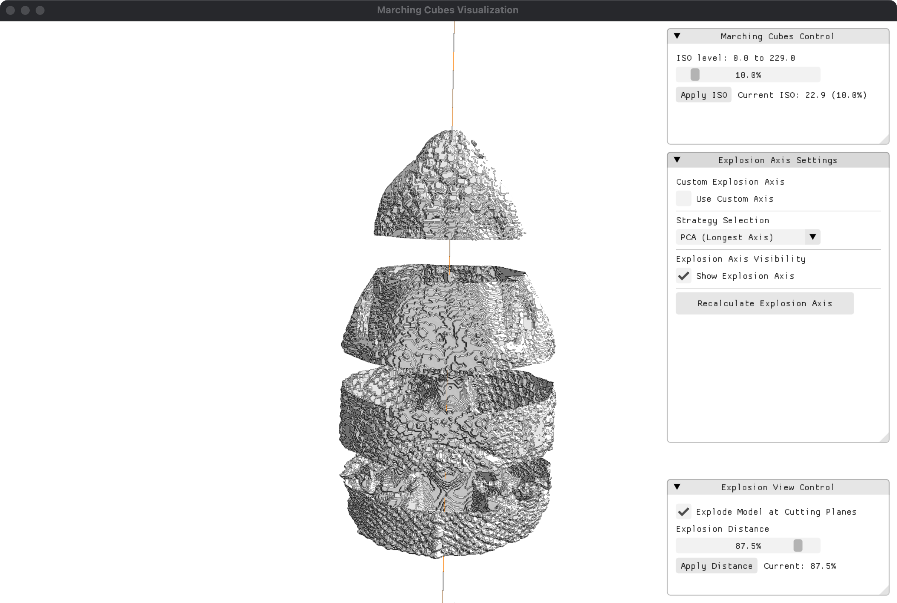
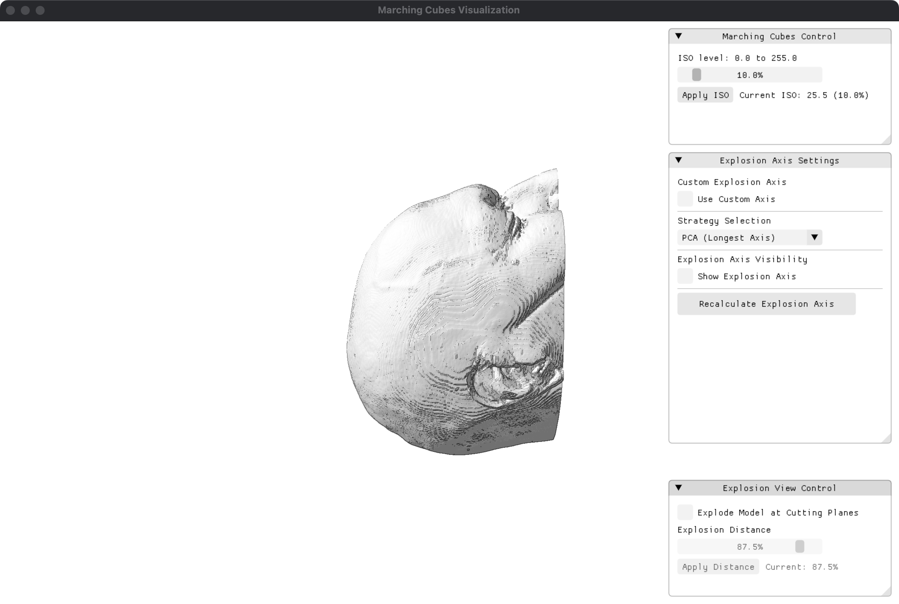
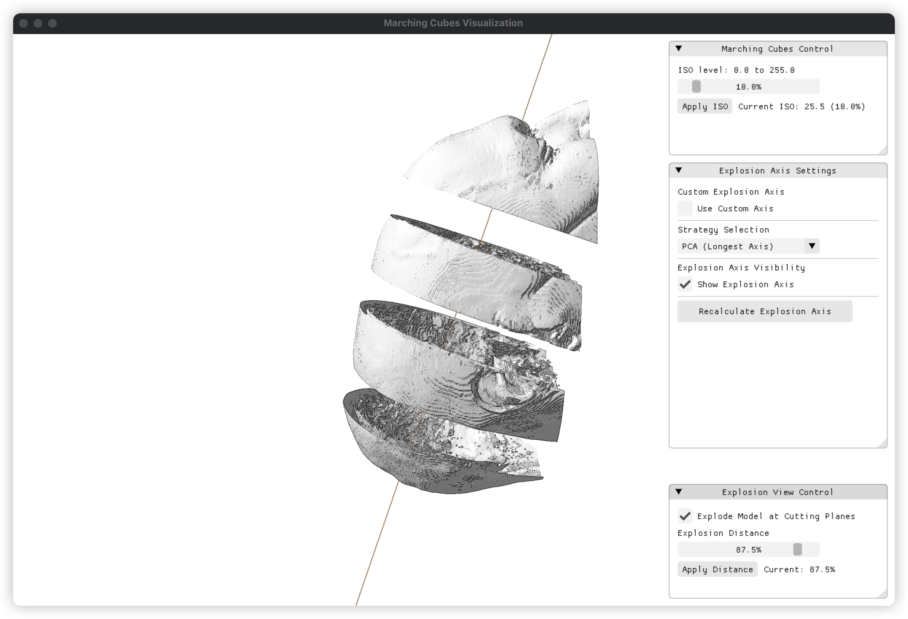
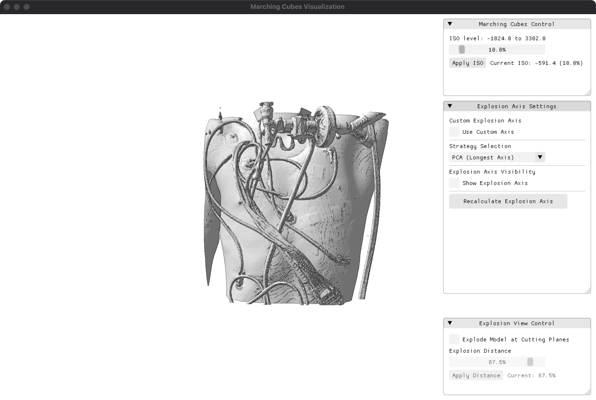
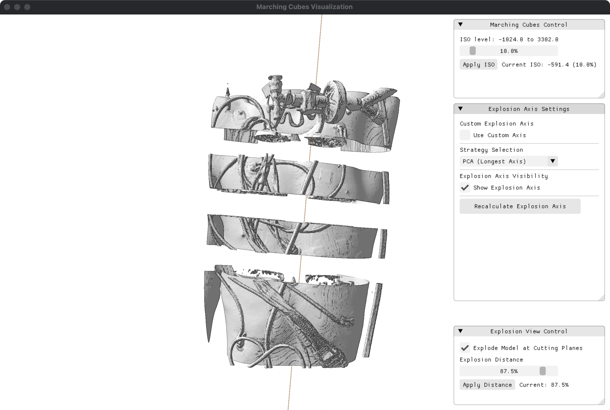
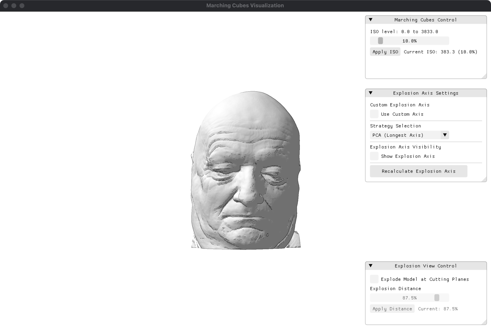
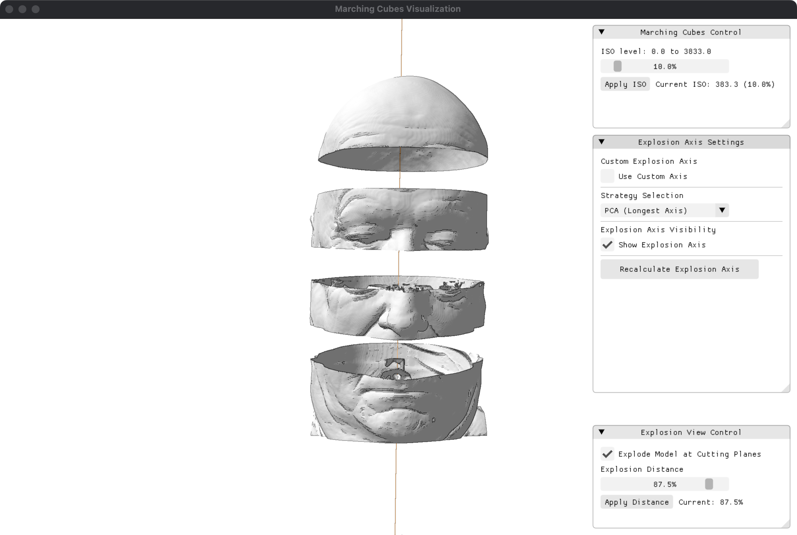

# ExplodedVolumes

[English](README.md) | [中文](README.zh.md) | [Nederlands](README.nl.md)



**ExplodedVolumes** is a C++17/OpenGL application for interactive visualization of volumetric data. It loads NIfTI volume data, extracts an iso-surface with Marching Cubes, computes or selects an explosion axis, constructs cutting planes, separates the resulting components, and renders the result in both normal and exploded-view modes.

The project is designed as a source-only archive and as a course project of TU Eindhoven. Third-party headers and platform-specific binary libraries are intentionally not bundled. Before compiling, each user must reconstruct the local dependency folder using libraries that match their operating system, CPU architecture, and compiler toolchain.

---

## Table of Contents

- [1. Project Context](#1-project-context)
- [2. Results](#2-results)
- [3. Functional Overview](#3-functional-overview)
- [4. Methodological Pipeline](#4-methodological-pipeline)
- [5. Source Tree](#5-source-tree)
- [6. Dependency Model](#6-dependency-model)
  - [6.1 Source-Only Distribution Policy](#61-source-only-distribution-policy)
  - [6.2 Shared Dependency Layout](#62-shared-dependency-layout)
  - [6.3 Platform-Specific Binary Rule](#63-platform-specific-binary-rule)
- [7. Windows Build](#7-windows-build)
- [8. macOS Build](#8-macos-build)
- [9. Running the Application](#9-running-the-application)
- [10. Interaction Guide](#10-interaction-guide)
- [11. VS Code Configuration Notes](#11-vs-code-configuration-notes)
- [12. Known Limitations](#12-known-limitations)
- [13. Third-Party Components and References](#13-third-party-components-and-references)

---

## 1. Project Context

Many volumetric data sets contain internal structures that cannot be adequately understood from the exterior iso-surface alone. An exploded view addresses this limitation by cutting a surface into a sequence of components and translating those components along a chosen direction. The resulting visualization exposes hidden geometry while preserving the spatial relationship between the separated pieces.

In this implementation, the input is a scientific or medical volume stored in NIfTI format. The program extracts a triangulated iso-surface, estimates candidate explosion directions, creates cutting planes, separates the mesh into components, and renders the output in an interactive OpenGL viewer. The rendering style is intentionally edge-enhanced to improve surface readability.

---

## 2. Results

### Main Interface



*Main window with Marching Cubes control panel, explosion axis settings, and explosion view controls*

### Exploded View

| Normal View | Exploded View |
|:-----------:|:-------------:|
|  |  |
|  |  |
|  |  |
|  |  |

*Comparison between normal rendering (left) and exploded view (right) for multiple datasets*

## 3. Functional Overview

The current implementation provides the following functionality:

- loading `.nii` NIfTI volume files through a native file dialog;
- extracting triangulated iso-surfaces with Marching Cubes;
- rendering normal and exploded views in an OpenGL 3.3 Core profile context;
- estimating or selecting explosion axes using PCA-, symmetry-, and combined-strategy code paths;
- constructing cutting planes and separating the mesh into exploded components;
- interactively adjusting the iso-level and explosion distance;
- visualizing the explosion axis;
- rotating and zooming the camera;
- applying a framebuffer-based post-processing pass for edge-enhanced rendering;
- exposing runtime controls through Dear ImGui.

---

## 4. Methodological Pipeline

The implementation can be read as the following data-flow pipeline:

```text
NIfTI volume
    ↓
VolumeData representation
    ↓
Marching Cubes iso-surface extraction
    ↓
Explosion-axis estimation or selection
    ↓
Cutting-plane generation and selection
    ↓
Surface segmentation
    ↓
Normal or exploded-view rendering
    ↓
Post-processing and ImGui overlay
```

The active rendering loop is located in `main.cpp`. Rendering and user-interface construction are implemented mainly in `visual.cpp`, while post-processing is handled by `post_processor.cpp`. Cutting-plane and exploded-view logic is implemented under `planes/`, and explosion-axis estimation is implemented under `explosionaxis/`.

---

## 5. Source Tree

A source-only copy of the project has the following approximate structure:

```text
.
├── main.cpp                         # Program entry point and active render loop
├── data.cpp                         # NIfTI loading and volume utilities
├── marching_cubes.cpp               # Marching Cubes iso-surface extraction
├── visual.cpp                       # GLFW/OpenGL/ImGui rendering and UI
├── post_processor.cpp               # FBO-based post-processing pass
├── glad.c                           # GLAD OpenGL loader implementation
├── nifti1_io.c                      # NIfTI reader implementation
├── znzlib.c                         # NIfTI low-level file I/O helper
├── file_dialog.h                    # Wrapper around portable-file-dialogs
├── headers/
│   ├── data.h
│   ├── marching_cubes.h
│   ├── visual.h
│   ├── post_processor.h
│   ├── explosionaxis/               # Explosion-axis strategy headers
│   └── planes/                      # Cutting-plane and exploded-view headers
├── explosionaxis/                   # Explosion-axis strategy implementations
├── planes/                          # Cutting-plane, selection, and exploded-view code
├── imgui/                           # Dear ImGui implementation files used by the project
└── dependencies/                    # Local dependency folder; reconstructed by the user
```

The `dependencies/` directory is normally not committed. It should be created locally according to the platform-specific build instructions below.

Input volume data is not required to be stored in the repository. For public releases, include only volume files that are public, licensed for redistribution, and properly de-identified where applicable.

---

## 6. Dependency Model

### 6.1 Source-Only Distribution Policy

This project is distributed as source code without third-party binary dependencies. This avoids shipping platform-specific libraries that may be incompatible with a different compiler, operating system, or CPU architecture.

In practice, this means:

- do not expect a pre-filled dependency folder in a clean source archive;
- reconstruct the dependency folder locally;
- use Windows libraries only for Windows builds;
- use macOS libraries only for macOS builds;
- do not mix binary artifacts from different operating systems, CPU architectures, or compiler toolchains.

### 6.2 Shared Dependency Layout

The build commands in this README assume the following local layout. Equivalent paths can be used, but the include and library flags must then be adjusted accordingly.

```text
dependencies/
├── include/
│   ├── GLFW/                        # GLFW headers
│   ├── glad/                        # glad.h
│   ├── KHR/                         # khrplatform.h
│   ├── glm/                         # GLM headers
│   ├── Eigen/                       # Eigen headers, or use an external Eigen include path
│   ├── imgui.h
│   ├── imconfig.h
│   ├── imgui_internal.h
│   ├── imstb_rectpack.h
│   ├── imstb_textedit.h
│   ├── imstb_truetype.h
│   ├── imgui_impl_glfw.h
│   ├── imgui_impl_opengl3.h
│   ├── nifti1.h
│   ├── nifti1_io.h
│   ├── nifti1_io_version.h
│   ├── znzlib.h
│   ├── znzlib_version.h
│   └── portable-file-dialogs.h
└── library/
    └── platform-specific libraries, such as GLFW and OpenMP runtimes
```

The following components are used by the application:

| Dependency | Role | Typical handling |
|---|---|---|
| C++17 compiler | Compiles the application | Clang, MinGW-w64, or MSVC |
| OpenGL 3.3 | Rendering backend | Provided by platform and graphics driver |
| GLFW | Window, OpenGL context, input | Header + platform-specific library |
| GLAD | OpenGL function loader | Compile `glad.c`; provide matching `glad/` and `KHR/` headers |
| Dear ImGui | Runtime GUI | Compile the bundled ImGui `.cpp` files; provide matching headers |
| GLM | Graphics mathematics | Header-only |
| Eigen | Linear algebra for axis estimation | Header-only |
| NIfTI C files | Volume loading | Compile `nifti1_io.c` and `znzlib.c`; provide matching headers |
| portable-file-dialogs | Native file dialog | Single header |
| OpenMP | Parallel CPU loops | Compiler flag and runtime library |
| zlib | Optional compressed NIfTI support | Link when `HAVE_ZLIB` is enabled or required by the local NIfTI configuration |
| PCL / VTK / Boost | Geometry and rendering support used by the current Makefile | Install with Homebrew on macOS |

### 6.3 Platform-Specific Binary Rule

Compiled libraries must match the target platform and compiler ABI.

| File type | Typical context |
|---|---|
| `.a` | Windows MinGW-w64 or compatible GCC-style toolchain |
| `.lib` | Windows MSVC |
| `.dll` | Windows runtime library |
| `.dylib` | macOS dynamic library |
| `.framework` | macOS system or framework dependency |

For example, MSVC should not link against MinGW `.a` files, and macOS `.dylib` files cannot be used in a Windows build. Apple Silicon builds require arm64-compatible dependencies; Intel macOS builds require x86_64-compatible dependencies.

---

## 7. Windows Build

Windows builds should use Windows-compatible headers and libraries only. Do not reuse macOS `.dylib` files, Homebrew paths, or macOS framework flags.

Create the local dependency directories:

```powershell
mkdir dependencies
mkdir dependencies\include
mkdir dependencies\library
```

Populate `dependencies\include` with the headers listed in [Section 6.2](#62-shared-dependency-layout), and place the matching Windows GLFW/OpenMP runtime libraries under `dependencies\library`.

### MinGW-w64

Run from the project root in PowerShell:

```powershell
$Sources = @(
  "glad.c", "znzlib.c", "nifti1_io.c",
  "imgui\imgui.cpp", "imgui\imgui_draw.cpp", "imgui\imgui_impl_glfw.cpp",
  "imgui\imgui_impl_opengl3.cpp", "imgui\imgui_tables.cpp", "imgui\imgui_widgets.cpp",
  "explosionaxis\eigen_reflective_symmetry_detector.cpp",
  "explosionaxis\eigen_rotational_symmetry_detector.cpp",
  "explosionaxis\explosion_axis_strategy.cpp",
  "explosionaxis\mitra_reflective_symmetry_detector.cpp",
  "explosionaxis\mitra_rotational_symmetry_detector.cpp",
  "explosionaxis\pca_analyzer.cpp",
  "explosionaxis\pcl_reflective_symmetry_detector.cpp",
  "explosionaxis\pcl_rotational_symmetry_detector.cpp",
  "explosionaxis\vector_ops.cpp",
  "planes\cutting_planes.cpp", "planes\exploded_view.cpp", "planes\selecting_planes.cpp",
  "data.cpp", "main.cpp", "marching_cubes.cpp", "post_processor.cpp", "visual.cpp"
)

g++ -std=c++17 -O2 -g -fopenmp `
  -I "dependencies\include" `
  -I "headers" `
  -I "headers\explosionaxis" `
  -I "headers\planes" `
  $Sources `
  -L "dependencies\library" `
  -lglfw3 -lopengl32 -lgdi32 -lole32 -lcomctl32 -loleaut32 -luuid `
  -o explodedvolumes-mingw.exe
```

If the GLFW build is dynamic, copy the matching GLFW `.dll` next to the generated executable.

### MSVC

Run from an x64 Native Tools Command Prompt for Visual Studio, or another shell where `cl.exe` is configured:

```bat
set GLFW_LIB=C:\path\to\glfw\lib-vc2022

cl /std:c++17 /EHsc /O2 /openmp ^
  /I dependencies\include ^
  /I headers ^
  /I headers\explosionaxis ^
  /I headers\planes ^
  glad.c znzlib.c nifti1_io.c ^
  imgui\imgui.cpp imgui\imgui_draw.cpp imgui\imgui_impl_glfw.cpp ^
  imgui\imgui_impl_opengl3.cpp imgui\imgui_tables.cpp imgui\imgui_widgets.cpp ^
  explosionaxis\eigen_reflective_symmetry_detector.cpp ^
  explosionaxis\eigen_rotational_symmetry_detector.cpp ^
  explosionaxis\explosion_axis_strategy.cpp ^
  explosionaxis\mitra_reflective_symmetry_detector.cpp ^
  explosionaxis\mitra_rotational_symmetry_detector.cpp ^
  explosionaxis\pca_analyzer.cpp ^
  explosionaxis\pcl_reflective_symmetry_detector.cpp ^
  explosionaxis\pcl_rotational_symmetry_detector.cpp ^
  explosionaxis\vector_ops.cpp ^
  planes\cutting_planes.cpp planes\exploded_view.cpp planes\selecting_planes.cpp ^
  data.cpp main.cpp marching_cubes.cpp post_processor.cpp visual.cpp ^
  /Fe:explodedvolumes-msvc.exe ^
  /link /LIBPATH:%GLFW_LIB% glfw3.lib opengl32.lib gdi32.lib ole32.lib comctl32.lib oleaut32.lib uuid.lib user32.lib shell32.lib
```

If the GLFW build is dynamic, copy the matching GLFW `.dll` next to `explodedvolumes-msvc.exe`.

---

## 8. macOS Build

The current build entry point is the root `Makefile`.

Install the Homebrew dependency set:

```sh
brew install glfw glm eigen boost pcl vtk libomp nlohmann-json
```

Prepare the local dependency layout expected by the Makefile:

```sh
mkdir -p dependencies/include dependencies/library
ln -sf "$(brew --prefix glfw)/lib/libglfw.3.dylib" dependencies/library/libglfw.3.4.dylib
ln -sfn "$(brew --prefix vtk)" dependencies/VTK
ln -sfn "$(brew --prefix glm)/include/glm" dependencies/include/glm
ln -sfn "$(brew --prefix eigen)/include/eigen3/Eigen" dependencies/include/Eigen
ln -sfn "$(brew --prefix boost)/include/boost" dependencies/include/boost
```

The project-local headers listed in [Section 6.2](#62-shared-dependency-layout) must also be available under `dependencies/include`.

Build:

```sh
make
```

If your PCL version differs from the Makefile default:

```sh
make PCL_VERSION=1.15.1
```

For Intel macOS or a custom Homebrew prefix:

```sh
make BREW_PREFIX=/usr/local
```

Clean build outputs:

```sh
make clean
```

---

## 9. Running the Application

macOS:

```sh
make run
```

Windows MinGW:

```powershell
.\explodedvolumes-mingw.exe
```

Windows MSVC:

```bat
explodedvolumes-msvc.exe
```

The application opens a file dialog. Select a `.nii` volume file for which you have permission to use and, if applicable, redistribute. Public releases should not include private or identifiable medical data.

---

## 10. Interaction Guide

| Action | Control |
|---|---|
| Rotate camera | Left mouse drag |
| Zoom | Mouse wheel |
| Adjust camera distance | `+` / `-` |
| Close application | `Esc` |
| Change iso-level | ImGui Marching Cubes control panel |
| Toggle exploded view | ImGui Explosion View control panel |
| Adjust explosion distance | ImGui Explosion View control panel |
| Show or hide explosion axis | ImGui Explosion Axis Settings panel |

---

## 11. VS Code Configuration Notes

For macOS, create a VS Code build task named `Build OpenGL` that runs:

```sh
make
```

A launch configuration can use:

```json
{
  "program": "${workspaceFolder}/app",
  "cwd": "${workspaceFolder}",
  "preLaunchTask": "Build OpenGL"
}
```

Use `${workspaceFolder}` rather than `${fileDirname}`. The latter changes depending on which file is currently focused in the editor and can lead to inconsistent build or runtime paths.

---

## 12. Known Limitations

- The repository does not yet provide a cross-platform CMake configuration.
- The source-only distribution requires users to reconstruct third-party headers and platform-specific libraries locally.
- The current Makefile is macOS-oriented and version-sensitive when PCL or VTK paths change.
- The current file dialog focuses on `.nii` input. Additional work may be needed for convenient `.nii.gz` handling.
- `imgui.ini` may be generated or updated by Dear ImGui to store UI layout. This is normal and does not indicate that input volume files have been modified.

---

## 13. Third-Party Components and References

Before compiling, check the availability of all third-party components used in the local build:

- [GLFW](https://www.glfw.org/)
- [GLAD](https://glad.dav1d.de/)
- [Dear ImGui](https://github.com/ocornut/imgui)
- [GLM](https://github.com/g-truc/glm)
- [Eigen](https://eigen.tuxfamily.org/)
- [portable-file-dialogs](https://github.com/samhocevar/portable-file-dialogs)
- [NIfTI C library](https://nifti.nimh.nih.gov/)
- [OpenMP](https://www.openmp.org/)
- [PCL](https://pointclouds.org/)
- [VTK](https://vtk.org/)

The visualization concept follows the general idea of exploded-view representations of complex surfaces, especially:

> Olga Karpenko, Wilmot Li, Niloy Mitra, and Maneesh Agrawala. **Exploded View Diagrams of Mathematical Surfaces.** *IEEE Transactions on Visualization and Computer Graphics*, 16(6), 2010, 1311–1318. DOI: `10.1109/TVCG.2010.151`.

The authors gratefully acknowledge M. Chamberland and H. van de Wetering for their guidance and valuable feedback during the development of this project.